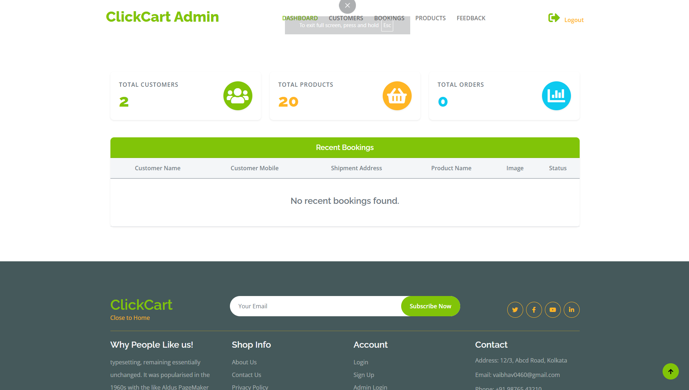
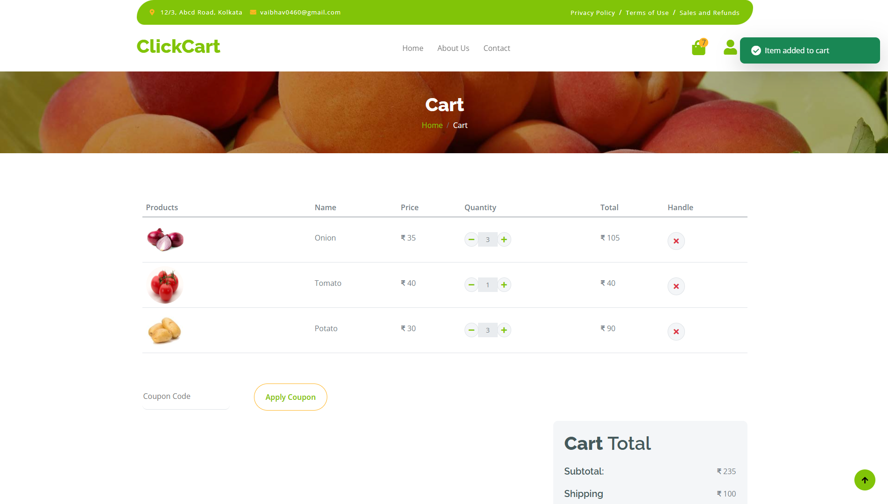
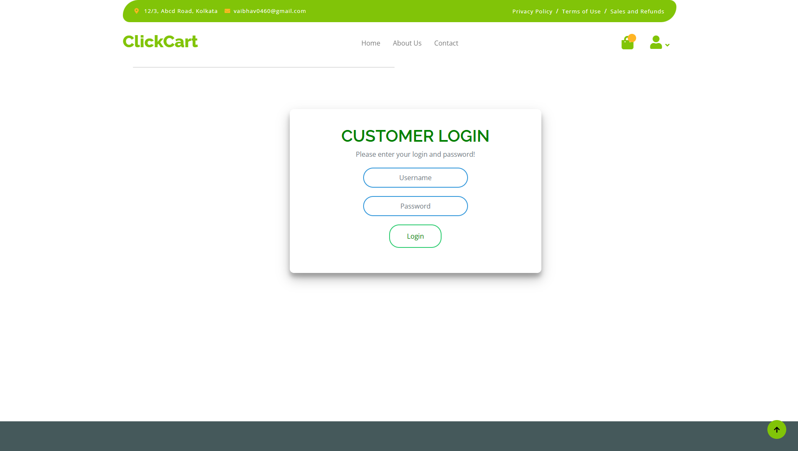

# ClickCart 🥗

ClickCart is a modern e-commerce web application built with Django, dedicated to providing fresh, organic vegetables and fruits. It features a seamless shopping experience for customers and a powerful management dashboard for administrators.

## 📸 Gallery

| Home Page | Admin Dashboard |
|:---:|:---:|
|  |  |

| Shopping Cart | Login/Signup |
|:---:|:---:|
|  |  |

## ✨ Key Features

### 👤 Customer Interface
* **User Accounts:** Secure login and registration system with profile management.
* **Product Catalog:** Browse organic products categorized by Fruits, Vegetables, and more.
* **Smart Cart:** Dynamic add-to-cart functionality with instant quantity updates.
* **Order Tracking:** View order history and status (Pending, Out for Delivery, Delivered).
* **Invoices:** Auto-generated PDF download for order invoices.

### 🛡️ Admin Dashboard
* **Analytics:** Visual cards displaying total customers, products, and orders.
* **Inventory Management:** Full control to add, update, or remove products.
* **Booking System:** Manage customer bookings and update shipment statuses.
* **Feedback:** Centralized view for customer inquiries and feedback.

## 🛠️ Tech Stack

* **Backend:** Python, Django
* **Frontend:** HTML5, CSS3, JavaScript, Bootstrap 5
* **Database:** SQLite (Default)
* **Utilities:** `xhtml2pdf` (PDF generation), `Pillow` (Image handling)

## 🚀 Installation & Setup

1.  **Clone the repository**
    ```bash
    git clone [https://github.com/yourusername/clickcart.git](https://github.com/yourusername/clickcart.git)
    cd clickcart
    ```

2.  **Install Dependencies**
    ```bash
    pip install -r requirments.txt
    ```
    *(Note: Ensure you use the file `requirments.txt` as spelled in the repo)*

3.  **Database Setup**
    ```bash
    python manage.py makemigrations
    python manage.py migrate
    ```

4.  **Create Admin Account**
    ```bash
    python manage.py createsuperuser
    ```

5.  **Run the Server**
    ```bash
    python manage.py runserver
    ```
    Access the site at `http://127.0.0.1:8000/`

## 👨‍💻 Credits

Developed by **Vaibhav Mishra**.
